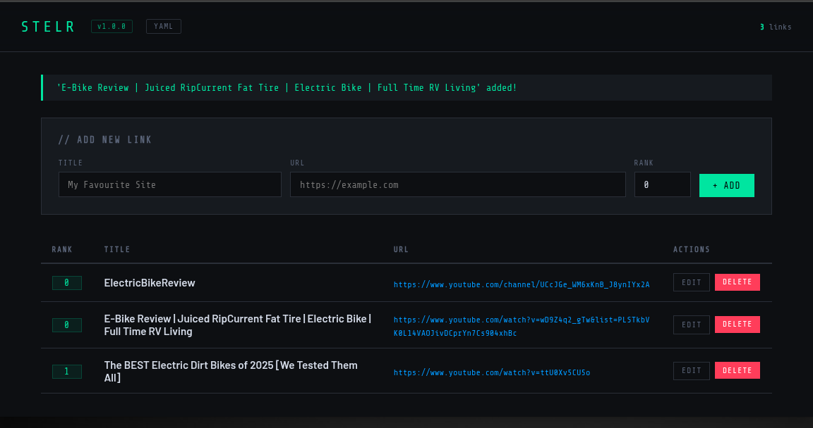
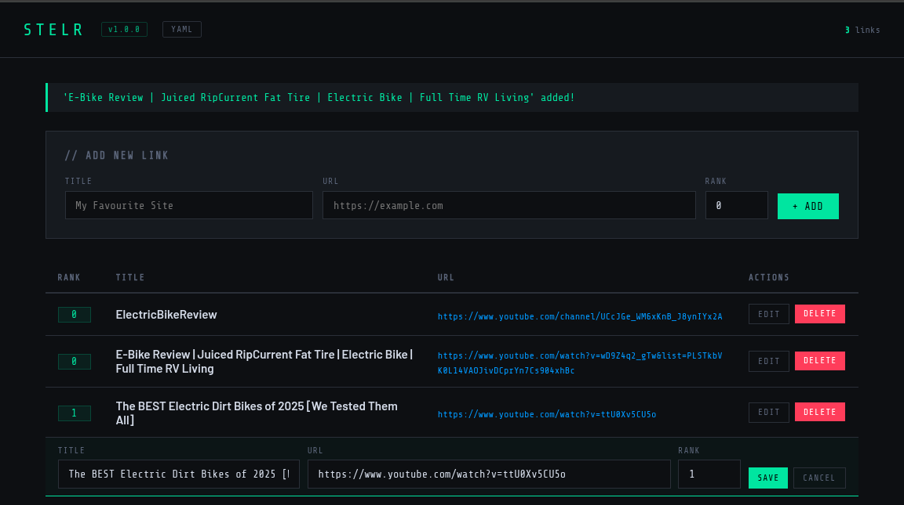

# 🔗 Stelr

**v2.5.2**

Stelr is a web app for saving, organising, and ranking URLs. Add any link with a
title and a numeric rank — Stelr keeps them sorted and accessible from any browser.
User accounts are required to access the app, with admin-controlled registration
and approval.

---

## New Features

- Admin can change user passwords
- User can change their own password

## Features

- Save URLs with a title and rank
- Edit or delete any saved link
- Links are always displayed sorted by rank (lowest first)
- User accounts with login, session timeout, and logout
- Admin-controlled user registration and approval queue
- REST API for programmatic access
- Choice of storage backend — from simple files to full databases
- Data is persisted across restarts via Docker volumes

## To Do

- Filter entries by keyword ( substring ) in title or URL
- Filter entries by rank numerical comparison - < <= == => >
- Sort entries by clicking the column header

---

## Getting Started

Open **http://localhost:8082** in your browser. You will be presented with the
login page. On first run, an admin account is created automatically using the
credentials set in the compose file (default: `admin` / `admin`).

---

## User Accounts

### Logging In
Enter your username and password on the login page. Sessions expire after a
configurable timeout (default 30 minutes) and you will be redirected to the
login page automatically.

### Registering
If registration is enabled by an admin, a **Register** link appears on the login
page. Fill in a username and password (minimum 6 characters) and submit. Your
account will be placed in a pending queue and cannot be used until an admin
approves it. If registration is disabled, the link is hidden and a message
instructs you to contact an administrator.

### Changing Your Password
Click the **Change Password** button in the header. Enter your current
password plus a new password (minimum 6 characters, entered twice to catch
typos). Your current password must be correct for the change to take effect.

### Logging Out
Click the **Logout** button in the top-right corner of any page.

---

## Using the App

Dashboard


### Adding a link
Fill in the **Title**, **URL**, and **Rank** fields at the top of the page and
click **Add**. Rank is a number — lower numbers appear first. You can use any
numbering scheme you like (1, 2, 3 or 10, 20, 30, etc.).

Dashboard


### Editing a link
Click the **Edit** button on any row to expand an inline edit form. Change the
fields you want and click **Save**.



### Deleting a link
Click the **Delete** button on any row. You will be asked to confirm before the
link is removed.

---

## Admin Panel

The admin panel is accessible via the **Admin** button in the header, visible
only to admin accounts. It is available at **/admin**.

### Registration Toggle
Enable or disable the public registration page with a single button. When
disabled, the register link is hidden from the login page and new users can
only be created directly by an admin.

### Pending Approvals
When registration is enabled, new sign-ups appear here awaiting approval. Each
entry can be **Approved** (activating the account) or **Rejected** (deleting
the registration). A warning badge in the header shows the number of pending
requests.

### Create User
Admins can create accounts directly, bypassing the registration queue. A
username, password, and optional admin flag can be set. Accounts created this
way are active immediately.

### Active Users
Lists all approved accounts. Each row has a **Reset PW** button that opens a
dialog to set a new password for that user (minimum 6 characters, entered
twice to catch typos) — no knowledge of their current password is required.
Non-admin users can be deleted, which also removes all of their saved links.
Admin accounts cannot be deleted.

### All Links
A read-only view of every link saved by every user, showing the owning username,
title, URL, and rank.

---

## REST API

| Endpoint      | Auth required | Description                                    |
|---------------|---------------|------------------------------------------------|
| `/api/links`  | Yes           | Returns your links as JSON, sorted by rank     |
| `/health`     | No            | Returns app status, version, and active backend |

---

## Storage Backends

Stelr supports five storage backends, selected at startup via the
`STORAGE_BACKEND` environment variable. On first run, each backend will
automatically create any required directory, file, or database — no manual
setup is needed.

### XML (default)
Links and users are stored in a plain XML file.

```
STORAGE_BACKEND=xml
```

Data file location is controlled by `XML_FILE` (default: `/data/links.xml`).

---

### YAML
Links and users are stored in a YAML file — human-readable and easy to inspect.

```
STORAGE_BACKEND=yaml
```

Data file location is controlled by `YAML_FILE` (default: `/data/links.yaml`).

---

### HTML
Links and users are stored in a structured HTML file. User data is embedded as
JSON in a `<script>` tag; links are stored as a `<ul>` list.

```
STORAGE_BACKEND=html
```

Data file location is controlled by `HTML_FILE` (default: `/data/links.html`).

---

### MySQL
Links and users are stored in a MySQL database. Stelr will create the database
and tables automatically on first run.

```
STORAGE_BACKEND=mysql
```

| Variable         | Default | Description   |
|------------------|---------|---------------|
| `MYSQL_HOST`     | `mysql` | Hostname      |
| `MYSQL_PORT`     | `3306`  | Port          |
| `MYSQL_USER`     | `stelr` | Username      |
| `MYSQL_PASSWORD` | `stelr` | Password      |
| `MYSQL_DATABASE` | `stelr` | Database name |

---

### PostgreSQL
Links and users are stored in a PostgreSQL database. Stelr will create the
database and tables automatically on first run.

```
STORAGE_BACKEND=postgresql
```

| Variable            | Default    | Description   |
|---------------------|------------|---------------|
| `POSTGRES_HOST`     | `postgres` | Hostname      |
| `POSTGRES_PORT`     | `5432`     | Port          |
| `POSTGRES_USER`     | `stelr`    | Username      |
| `POSTGRES_PASSWORD` | `stelr`    | Password      |
| `POSTGRES_DB`       | `stelr`    | Database name |

---

## Configuration

| Environment Variable      | Default                  | Description                              |
|---------------------------|--------------------------|------------------------------------------|
| `STORAGE_BACKEND`         | `xml`                    | Storage plugin to use                    |
| `ADMIN_USERNAME`          | `admin`                  | Username for the auto-created admin      |
| `ADMIN_PASSWORD`          | `admin`                  | Password for the auto-created admin      |
| `SECRET_KEY`              | *(default set)*          | Flask session secret — change in production |
| `SESSION_TIMEOUT_MINUTES` | `30`                     | Session inactivity timeout in minutes    |

---

## Starting Stelr

Use the `--profile` flag to select a backend. The app is available at
**http://localhost:8082**.

```bash
# XML (default)
podman compose up

# YAML
podman compose --profile yaml up

# HTML
podman compose --profile html up

# MySQL
podman compose --profile mysql up

# PostgreSQL
podman compose --profile postgresql up
```

To run in the background, add `-d`:

```bash
podman compose --profile yaml up -d
```

To stop without remo1ving data:

```bash
podman compose --profile yaml stop
```

To stop and remove all data volumes (fresh start):

```bash
podman compose --profile yaml down -v
```

### Changing the admin password or session timeout

```bash
ADMIN_PASSWORD=mysecurepassword SESSION_TIMEOUT_MINUTES=60 podman compose up
```
